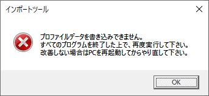

# 《 Import-Profile 》

_Mozilla Firefoxのプロファイルデータのインポートスクリプト_

### 〔概要〕

[][1]

このスクリプトを導入した動機は、業務で利用するブラウザとして、一般設定やブックマークだけでなく、カスタムスタイルシートやプロキシ設定、SSL証明書もプロファイルデータとして一括管理、移行が容易な[Mozilla Firefox][1]を採用したことです。 
用途に応じたプロファイルデータを共有フォルダから一括インポートして、新規スタッフの受け入れや新規業務の開始の際のブラウザの初期設定、アップデートなどによる更新作業のの手間を省くために、プロファイルデータのインポート用スクリプトとして作成したものです。 
すでに[MozBackup][2]という優れたツールが存在しますので、差支えが無ければこちらを利用したいところでしたが、まずフリーソフトの導入が許可されていない環境であり、また**MozBackup**は高機能であるがゆえに、新規スタッフには使用方法の習得が必要となることもあり、限られた機能のシンプルな専用ツールが必要と思われました。

[1]: https://www.mozilla.org/ja/firefox/
[2]: http://mozbackup.jasnapaka.com/

### 〔導入作業〕

まずは共有データの作成を実施します。共有したいプロファイルのFirefoxを起動して特殊URL`about:support`にアクセスし、**アプリケーション基本情報**のテーブルで**プロファイルフォルダー**という項目の`フォルダを開く`ボタンをクリックします。

プロファイルデータが保存されているフォルダを開いた状態で、エクスプローラーが起動します。

このフォルダ内のファイルとフォルダをすべて選択し、共有プロファイル用に作成したフォルダにコピーします。 
このような手順で作成したデータフォルダと同じフォルダに、スクリプトファイル[Import-Profile.wsf][3]を配置しておきます。

[3]: https://raw.githubusercontent.com/singularity-effect/wsf-next/master/Import-Profile/Import-Profile.wsf

### 〔使用方法〕

ログイン中のユーザーでまだ一度もFirefoxを起動していない場合は、事前に一度起動してデフォルトのプロファイルを作成しておいてください。

デフォルトのプロファイルが作成されていない場合、エラーで失敗します。

スクリプトファイル**Import-Profile.wsf**（またはそのショートカットファイル）をダブルクリックするなどして起動します。もしFirefoxが起動中の場合は、強制終了するかどうかポップアップ表示で訊ねます。

強制終了せずに続行すると、競合による書き込みエラーでインポートに失敗することがあります。

まずプロファイルデータを選択するダイアログボックスが表示され、事前に作成しておいたデータフォルダが列挙されます。

インポートしたいデータフォルダを選択した状態で、［**OK**］ボタンをクリックします。

デフォルトのプロファイルが存在すれば、下記のように事前確認のポップアップが表示されますので、［**OK**］で続行。［**キャンセル**］で中止できます。

しばらく待っていると、インポートが完了しますので、［**OK**］で終了します。

&nbsp;&nbsp;&nbsp;&nbsp;&nbsp;

データのコピー処理は、別プロセスで[robocopyコマンド][4]を起動して行っています。 
プロファイルデータが配置されているフォルダは、例えばユーザー名が`Owner`である場合は`C:\Users\Owner\AppData\Roaming\Mozilla\Firefox\Profiles`となっており、ここにログファイルが`Import-Profile.log`として残ります。 

[4]: https://docs.microsoft.com/ja-jp/windows-server/administration/windows-commands/robocopy

元のプロファイルデータは消去されるわけではなく日付と時刻をベースとしたフォルダ名で残されますが、最新の3世代までとし、それ以前のものは消去するようにローテーションします。 
またツールの仕様としてログイン情報はインポート前のものを引き継いで利用できるようになっています。

### 〔補足〕

データのエクスポートをサポートする機能は備えていないため、共有データを作成する際に履歴やキャッシュ、ログイン情報といったものを手作業で消去しなければならないことも有るので、その点では**MozBackup**のようなツールには優位な点が多々あります。

