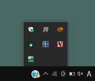
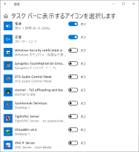
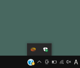
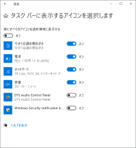

# 《 Incognito 》

*タスクトレイに残った常駐ソフトのアイコンのキャッシュ削除スクリプト*

### 〔概要〕

[][1]
&nbsp;&nbsp;&nbsp;&nbsp;&nbsp;
[][2]

 

一時的に他人のPCを借りて使ったり、組織で複数メンバーの共用PCを使った場合、WEB閲覧などの履歴が残ったままだと気になることがありますが、何らかの常駐ソフトを使ったときにタスクトレイにアイコンが消えずに残っているのも、あまり気持ちが良いものではないと思います。 
とはいえ、手作業でレジストリの削除などの工程を踏むのもなかなか煩わしいと思い、スクリプトにより1ステップで完了できるようにするという目的で作成しました。

[1]: https://raw.githubusercontent.com/singularity-effect/wsf-next/master/Incognito/figure1.png
[2]: https://raw.githubusercontent.com/singularity-effect/wsf-next/master/Incognito/figure2.png

### 〔使用方法〕

自分で起動した常駐ソフトをすべて終了してから、スクリプトファイル[Incognito.wsf][3]をダブルクリックするなどして実行するだけです。実行中の常駐ソフトのアイコンは残ったままになります。 
また、個別にアイコンを選択して削除出来るわけではなく、過去に他のユーザーが使ったソフトのアイコンが残っていたら、それもまとめて一括削除されます。

[3]: https://raw.githubusercontent.com/singularity-effect/wsf-next/master/Incognito/Incognito.wsf

[][4]
  &nbsp;&nbsp;&nbsp;&nbsp;&nbsp;
[][5]

 

[4]: https://raw.githubusercontent.com/singularity-effect/wsf-next/master/Incognito/figure3.png
[5]: https://raw.githubusercontent.com/singularity-effect/wsf-next/master/Incognito/figure4.png

### 〔注意点〕

このスクリプトはExplorerを再起動しますので、Explorerのウィンドウを開いたままで実行すると、すべて強制的に閉じられます。
