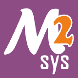
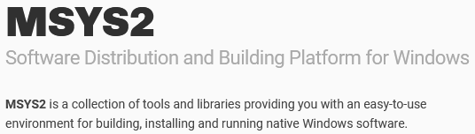
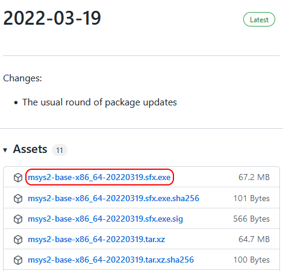
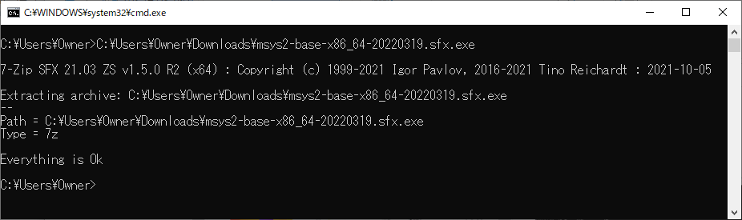
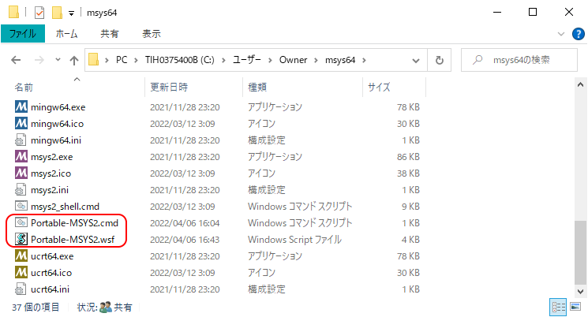
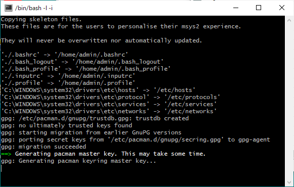
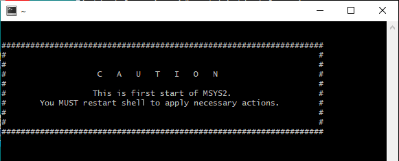

# 《 Portable-MSYS2 》

_MSYS2のポータブル起動スクリプト_

### 〔概要〕

<div>

[][1]
&nbsp;&nbsp;&nbsp;&nbsp;&nbsp;
]

</div>

[1]: https://www.msys2.org/

USBメモリや共有フォルダに配置した[MSYS2][1]を、一時的に他ユーザーのPCや共用PCなどから起動すると、ユーザー名が変わることによってホームディレクトリが変わってしまいます。<br>
そのために、常用しているリソースファイルが適用されなかったり、ハードリンク`~`のリンク先が変わってしまうことにより、不便を感じることがあります。<br>
このスクリプトは、常に決まったホームディレクトリに固定しておけるようにすることによって、MSYS2をポータブルで運用可能とするという狙いで作成したものです。

### 〔導入作業〕

2022年4月時点での最新版を前提とします。[GitHubのリリースページ][2]から`sfx.exe`形式の7-Zip形式の事項解凍アーカイブをダウンロードします。

[][2]

ダウンロード完了後に、このファイルを実行すると、コマンドプロンプトが出現し、アーカイブの展開が始まります。

[]

終わるとカレントディレクトリに`msys64`というフォルダが作成されていますので、このフォルダ直下に[Portable-MSYS2.wsf][3]と[Portable-MSYS2.cmd][4]の2つのスクリプトファイルを保存すると準備は完了です。<br>



後は、この`msys64`フォルダをUSBメモリや共有フォルダなどに移動できますが、配置したフォルダのパスには全角文字が含まれてはならないので、ご注意ください。<br>
フルパスに半角スペースや全角文字が含まれるファルダに配置しなければならない場合は、ネットワークドライブに割り当てるか、管理者権限が有ればシンボリック・リンク（同一ボリュームであればジャンクションでも可）を作成して問題を回避できますが、共有PCや他ユーザーのPCを借りている場合は、使った後に自身で削除しておかなければならないでしょう。

[2]: https://github.com/msys2/msys2-installer/releases

### 〔使用方法〕

スクリプトファイル[Portable-MSYS2.wsf][3]またはそのショートカットファイルをダブルクリックするなどして起動すると、ターミナルソフト[Mintty][5]が表示され、デフォルトのシェルBashが利用できるようになるはずですが、初回の起動に限りまず初期設定作業が必要となります。<br>
下記のようにターミナルに作業のログが出力され、終わるまでしばらく時間がかかります。



初期設定が完了すると`CAUTION`が表示されて、そのまま終了するよう促されますので、いったんターミナルを閉じます。



改めて起動すると、今度はシェルのプロンプトが表示されて、入力待ちになります。<br>
このスクリプトは多重起動は出来なくなっており、起動に失敗したり、エラーで異常終了した場合は、メモ帳を起動して、出力を表示します。

またスクリプトを修正することにより、起動方法を変更できるようになっています。<br>
デフォルトではホームディレクトリは`/home/admin`実行環境は`MSYS`となっていますが、冒頭の下記の2つの**reousrce**タグを書き換えることにより、カズタマイズ出来ます。

```xml
<resource id="UNAME">"admin"</resource>
<resource id="SYS">$("SYS64").MSYS</resource>
```
まず**id**が`UNAME`のタグでホームディレクトリのユーザー名部分を設定出来ます。ログインユーザー名として認識されるわけではなく、あくまでホームディレクトリを使い分けるための識別名の役目を果たします。ホームディレクトリが`/home/ユーザー名`に設定されます。<br>
`SYS`のほうは`MINGW64`や`CALANG64`など、MSYS2で用意されているいくつかのプリセット値のうちのどれかを指定します。

### 〔補足〕

**Mintty**以外のターミナルなどから同様の環境設定により起動する場合は、下記のバッチファイル[Portable-MSYS2.cmd][4]で起動して下さい。<br>
必要に応じて、冒頭で設定している変数`UNAME`でHOMEディレクトリのユーザー名、`SYS`で起動する実行環境を適宜変更してください。デフォルトはそれぞれ`admin`と`MSYS`となっています。

```cmd
@echo off
set UNAME=admin
set SYS=MSYS

for /f "usebackq delims=: tokens=1-5" %%i in (`%~d0%~p0usr\bin\mkpasswd -c`) do (echo %%i:%%j:%%k:%%l:%%m:/home/%UNAME%:/bin/bash > %~d0%~p0etc\passwd)
%~d0%~p0usr\bin\mkgroup -c > %~d0%~p0\etc\group

%~d0%~p0usr\bin\env PATH=%~d0%~p0usr\bin MSYSTEM=%SYS% HOME=/home/%UNAME% /bin/bash --login -i %*

exit /b
```

[3]: https://raw.githubusercontent.com/singularity-effect/wsf-next/master/Portable-MSYS2/Portable-MSYS2.wsf
[4]: https://raw.githubusercontent.com/singularity-effect/wsf-next/master/Portable-MSYS2/Portable-MSYS2.cmd
[5]: https://mintty.github.io/
