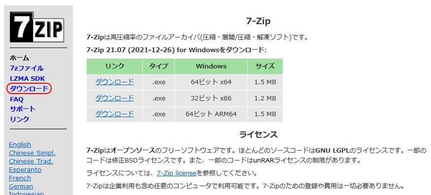
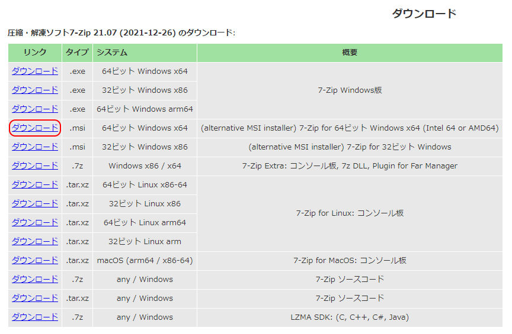
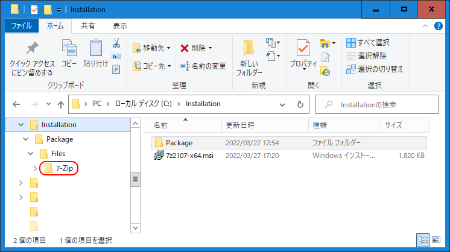

# 《 Stealth-7Z 》

*7-Zipファイラーのポータブル起動スクリプト*

### 〔概要〕

[][1]

業務に使用しているPCなど、セキュリティポリシーによりソフトウェアのインストールを制限されていたり、規則で禁じられている場合などに、インストール無しで2ペイン型ファイラーとしても使える高機能アーカイバソフト[7-Zip][1]を起動して利用するためのスクリプトです。

例えばUSBメモリや共有フォルダから起動しても、終了時にレジストリから設定情報を実行ファイルと同じフォルダにエクスポートして保存した上で、該当のレジストリを削除することにより、設定を置き去りにしないようにします。<br>
また次回起動時にはファイルから前回の設定をロードするので、設定を維持できるようになっています。なおスクリプトからの多重起動に関しては、競合による問題が起こらないようになっています。

[1]: https://sevenzip.osdn.jp/

### 〔導入作業〕

まず事前に作業用のフォルダを作成します。ここではCドライブのルートフォルダに、下記のようにコマンドプロンプトにてフォルダ名を`Installation`として作成します。

```cmd
mkdir C:\Installation
```

[][2]

次に[公式サイト][1]の[ダウンロードページ][2]からexeファイルではなくmsiインストーラーファイルをダウンロードします。ここでは64ビット版(2022年3月現在で`7z2107-x64.msi`)を`C:\Installation`フォルダに保存します。

[2]: https://sevenzip.osdn.jp/download.html

続いて入手したmsiファイルをコマンドプロンプトにて、下記のコマンドを実行し`C:\Installation\Package`ディレクトリに展開します。

```cmd
msiexec /a C:\Installation\7z2107-x64.msi targetdir=C:\Installation\Package /qn
```

完了後のフォルダの構成はこのようになっています。



この中の`7-Zip`ディレクトリに実行環境が展開されていますので、このフォルダ直下に[Stealth-7Z.wsf][3]を保存します。<br>
後は`7-Zip`フォルダを任意のドライブやディレクトリに移動して、必要応じて好きなフォルダ名に変更します。<br>

[3]: https://raw.githubusercontent.com/singularity-effect/wsf-next/master/Stealth-7Z/Stealth-7Z.wsf

### 〔使用方法〕

以後は実行ファイル`7zFM.exe`からではなく、スクリプトファイル（またはそのショートカットファイル）をダブルクリックするなどして起動して下さい。

### 〔注意点〕

終了時にレジストリから設定情報を削除するので、もともと7-Zipがインストールされている場合は、インストール版を利用するべきです。

