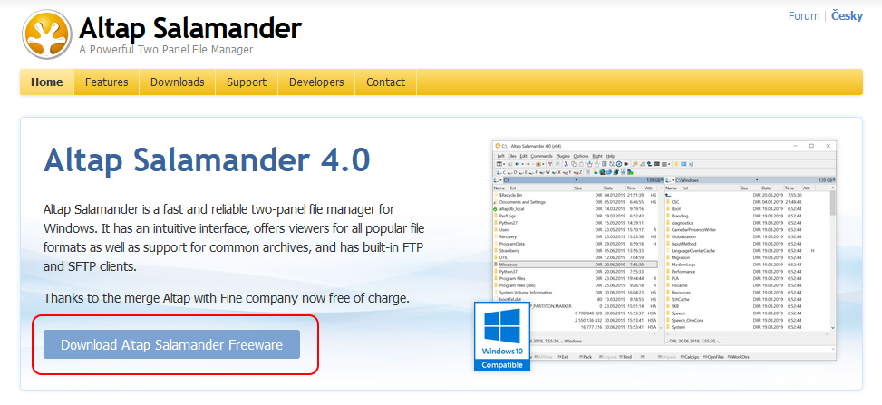
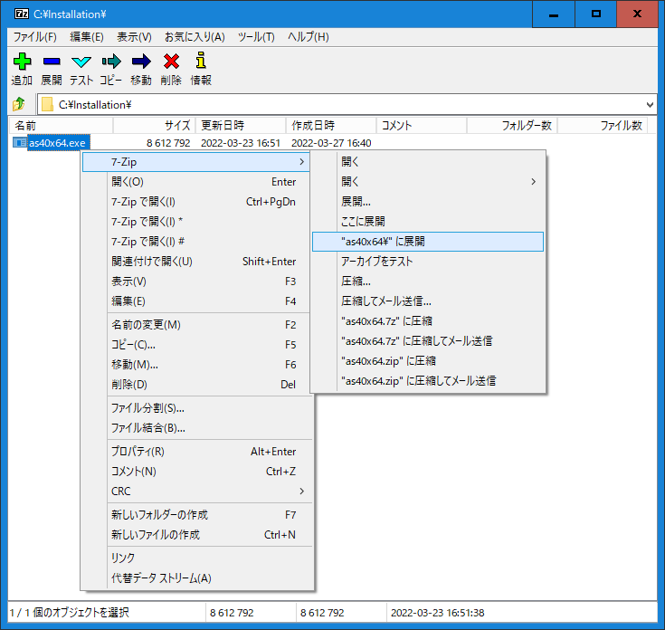

# 《 Stealth-AS 》

*Altap Salamanderのポータブル起動スクリプト*

### 〔概要〕

[][1]

[Salamander][1]とは、画像ビューア、レジストリエディタ、FTPクライアント、ファイル検索、ファイル比較、アーカイバなど様々なプラグインが利用できる、日本語には非対応ですが高機能な2ペイン型ファラーです。 
ここでは、業務に使用しているPCなど、セキュリティポリシーによりソフトウェアのインストールを制限されていたり、規則で禁じられている場合などに、インストール無しでSalamnderを起動して利用するためのスクリプトを公開しています。

例えばUSBメモリや共有フォルダから起動しても、終了時にレジストリから設定情報を実行ファイルと同じフォルダにエクスポートして保存した上で、該当のレジストリを削除することにより、設定を置き去りにしないようにします。 
また次回起動時には設定情報を実行ファイルと同じフォルダから前回の設定をレジストリにロードするので、実行環境が変わっても設定を維持できるようになっています。なおこのスクリプトから多重起動した場合、競合による問題が起こらないようになっています。

[1]: https://www.altap.cz/

### 〔導入作業〕

まず[公式サイト][1]の[ダウンロードページ][2]からexeファイルのインストーラーをダウンロードします。 
インストーラーは7-Zip形式の自己解凍圧縮ファイルのため、展開するには対応できるフリーソフトなどのアーカイバが必要になります。 
一例として[7-Zip][3]のファイルマネージャーを使用します。 

[2]: https://www.altap.cz/salamander/downloads/
[3]: https://sevenzip.osdn.jp/

ここでは`C:\installation`フォルダに64ビット版インストーラー`as40x64.exe`をダウンロードしたものとして話を進めます。
7-Zipを起動したら`as40x64.exe`を右クリックし、下記のように`"as40x64\"に展開`を実行します。

作成された`as40x64`フォルダに実行環境がコピーされますので、直下に起動スクリプト[Stealth-AS.wsf][4]を配置します。 
後は、このフォルダをUSBメモリや共有フォルダなど希望の場所に移動し、必要に応じて好きなフォルダ名に変えても構いません。 

[4]: https://raw.githubusercontent.com/singularity-effect/wsf-next/master/Stealth-AS/Stealth-AS.wsf

### 〔使用方法〕

以後は実行ファイル`salamand.exe`から直接起動する代わりに、スクリプトファイル（またはそのショートカットファイル）から起動させるようにして下さい。

### 〔注意点〕

終了時にレジストリから設定情報を削除するので、もともとSalamanderがインストールされている場合は、インストール版を利用するべきです。
