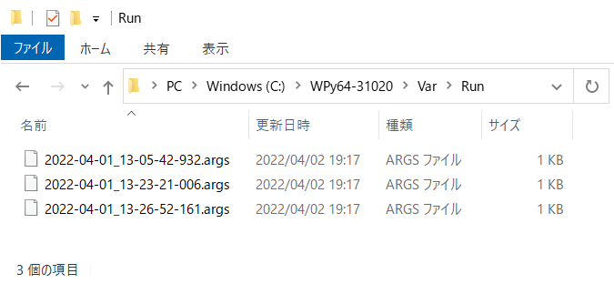

# 《 Win-Jupyter 》

*WinPython版Jupyter Labの起動、ログファイル管理スクリプト*

### 〔概要〕

[][1]

Windows版Pythonのディストリビューション[WinPython][1]のパッケージにバンドルされている[Jupyter Lab][2]を起動するスクリプトです。

[1]: https://winpython.github.io/
[2]: https://jupyterlab.readthedocs.io/

### 〔導入作業〕

[公式サイト][1]で各々のバージョンの`Packages`リンクにて収録パッケージに**jupyterlab**が含まれているインストーラーファイルを確認し、[Sourceforge][3]からダウンロードします。バージョンごとにいくつかのインストーラーが用意されていますが、ファイル名に`dot`が含まれていない数100MBのサイズのインストーラーであれば**jupyterlab**は含まれているはずです。 
特定のバージョンを必要としていなければ、**Latest Version**をダウンロードします。

[][1]

[3]: https://sourceforge.net/projects/winpython/files/

インストーラーは7-Zip形式の自己解凍アーカイブですので、実行すると任意のインストールフォルダを選択して、圧縮されたファイルを展開するだけです。続いてスクリプトファイル[Win-Jupyter1.wsf][4]および[Win-JupyterX.wsf][5]の2つをインストールフォルダ直下に保存すれば準備は完了です。

[4]: https://raw.githubusercontent.com/singularity-effect/wsf-next/master/Win-Jupyter/Win-Jupyter1.wsf
[5]: https://raw.githubusercontent.com/singularity-effect/wsf-next/master/Win-Jupyter/Win-JupyterX.wsf

### 〔使用方法〕

運用方法により2種類のスクリプトファイルが有ります。どちらかをダブルクリックするなどして起動します。

#### ◆ _Win-Jupyter1.wsf_

誤って多重起動できないようシングルインスタンスによる起動スクリプトです。起動オプションを受け付けないので、常にデフォルトのポート番号（設定ファイルで指定しなければ8888番）での起動となり、多重起動しようとするとポップアップを表示して、そのまま終了します。

その他タスクマネージャーから強制終了した場合など、異常終了の場合は、ログの最新の10行をポップアップ表示して知らせます。

出力ログはコマンドプロンプトではなく、インストールフォルダ直下にサブフォルダ`Var\Log`を作成し、ファイル名`Win-Jupyter.log`に出力します。エンコードはutf-8としているので、Jupyter Labエディタで読み込むこともできます。 
また、サーバーをシャットダウンする際に最新のログ100行のみ保存し、それ以前のログは消去するようにローテーションを実行します。

#### ◆ _Win-JupyterX.wsf_

多重起動して運用できる起動スクリプトです。ただし誤って多重起動することを避けるため、通常はデフォルトのポート番号（設定ファイルで指定しなければ8888番）で起動します。そのため、すでに同じポートを使用中の場合は競合によるエラーを表示して終了します。

かわりに起動時に起動オプションを受け付けるので、`--port=ポート番号`で未使用のポート番号を指定することにより、複数インスタンスを起動できます。

ログファイルは起動するたびに日付と時刻をベースとして命名されたログファイルが個別に作成されます。
また、すべてのサーバーをシャットダウンする際に、最新のログファイルを10ファイルのみ保存し、それ以前のログファイルは消去するようにローテーションを実行します。

### 〔補足〕

サーバーが起動中かどうかは、インストールフォルダ直下に作成されるサブフォルダ`Var\Run`で確認できます。

